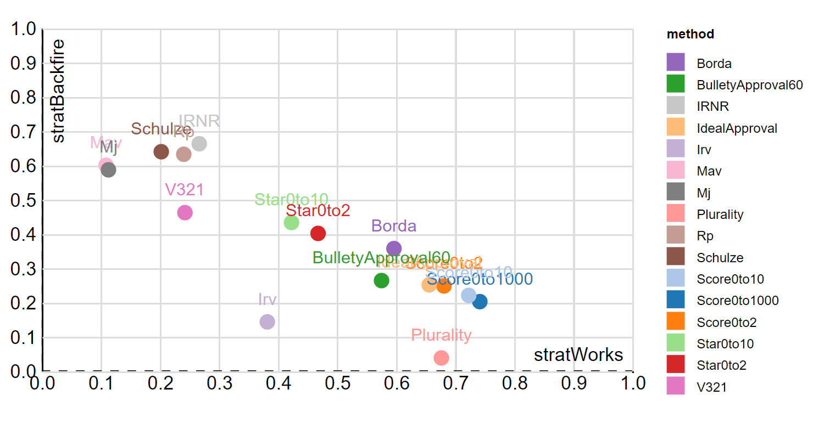



I'd like to describe on this page how Condorcet voting methods can help us find a common ground candidate and elect them. 

I'll go into detail to explain the hard-to-understand parts of Condorcet methods. For that mental effort, you'll get the benefit of not needing to think about the polls to decide who to vote for but simply be able to vote for the candidates in the order you like. And you'll have better candidates to vote for.

## Intro to Condorcet

[If you haven't yet, please read this page about how counting votes for each pair of candidates allows us to find common ground](commonground). 

To summarize, the key mechanism that allows this method to work so well is that your support goes 100% to the candidate you like better out of every pair of candidates. This is a lot better than just choosing one candidate: there's no spoiler effect and there's no vote splitting. This is a tremendous burden off of the voters and the candidates. 

{% include sim.html 
link = "[link](https://paretoman.github.io/ballot/sandbox/?v=2.5&m=H4sIAAAAAAAAA3VSu04DMRD8F9cuvN5dP67mCxDd6YpADnEiukQkCCEE387awzVBkYvxPjyeWfvLBTeMY2ZPsU5-JFJPhdtOg-VK21XL5VaNsVpOp8k7asdYvLW1kN0QvBM3uJ_qvFM3kHfJeqyWDYL_t6xSblbqzQqFfhURyCkihAASgAJSl0EmgMTQrlOD2ovReCwZqffECABNFERGwwYJyYyoIDKWaL5DF0ptBGBiCGIwMZjYmEbyf6s1JxwHJ8Mu-ejZi5Wl0bY-aTabbYnbhreS9LNyTS1wLRlPArlSe1IxPCUATCukKmaneDuFaQWLln6XwnQKABhOMJzAkrRbsR_kEigSFCSMPUNBxtkMBZkBUJDxenn7PhnFcjWjDEsFhAWWCsQUiCkgLCAs0PO4OxyOl4fP02y_9X63vs57-7Hnl-PH3Xx-eltOl-W4to_8vu7n52W18vcv6dXEticDAAA)" 
title = "Pairwise Ranked Ballot"
caption = ""
comment = ""
id = "1"
gif="gif/pair_ballot.gif"
%}

We're going to use that background map for ballot visualization in the two elections below. We'll overlay the ballots for all the voters to try to make it more clear how everybody's ballots get added together.

{% include sim.html 
link = "[link](http://127.0.0.1:4000/ballot/sandbox/?v=2.5&m=H4sIAAAAAAAAA3WSMWsDMQyF_4tmUyxbsnVZC50zZDtuSNsMhaMpIR1CaX97Zb0GAiVkeFYkv3xP8Rdl2swzF0usuqSZTfxUxilbKpWXJRHHjGbv5FFX2uREQhv6yZRIo2w-5L3uktO_j3fsbme62-Ec3jwIoi6oQcACAQA3iBOwuPrvVRc350TFjfzL4kbFpUBgUwQjGhcKbEpHZaimuFBzkPLYAUejAqhW9AFU3WnmxBhsaMGvIisnXzFJ_osl13xSrgc3nGNG4p7cWkoLYOn4H4AoCKrYmAJPEVSBpwiqCkFQ7ehhXYqgLUM4JhtCNqyraUSoDtJg0UDQppAOgo67vUAqBAvqIOjjzdDTdrf1V_R4fH89nl4OZxqvqGPAbrbVEdAyBPYGNAOaSWCbQkBn8DKDDMiHnuh5v67H8-7ycfB3vF0_T_v17Xyh718YJyuqEwMAAA)" 
title = "FPTP Spoilers, Condorcet None"
caption = "Switch between FTPTP and Condorcet"
comment = "Example of no spoiler effect - basic spoiler intro stuff."
id = "condorcet_2" 
gif = "gif/condorcet_2.gif"
%}

{% include sim.html 
link = "[link](http://127.0.0.1:4000/ballot/sandbox/?v=2.5&m=H4sIAAAAAAAAA3VSsU5DMQz8F88Wih07SbsiMXfo9tShQAekiiJUhgrBt-P46AKq3nB2bF_u_PJJhdbLItVYXHe8yBCWUiNSrSxjRmLOahKRexyV3Y5JcsxLjGVeaV2YjNb0XYjJM23RFLUeUPjfF5Vxs7K6WZGS3DIVZK7IoUAMAAHSAKFALDDu84AgFyYNojjUINIABYBGDS1BUwNAox3ZQLbKgVpSqcwdSBYqBNWKOgTVYFpitfhmc0MZnBV-hZUrW5St_Nqzq0_TaxDEi87Actb-UltL8dbxTyDXYNqxPYdUh2mHVIdpdwBMe0dt5F0O060AJDsbDDesrnlaiYdDDRQNCtoqoUNBx2xXQAVgWR0K-nw_9LDZbuJF3Z9en0_vT4czzRfV0TCuW5tnMDgKAPQD0gakDUvZwwFQN8A1BmCKvOtMj_vj8XTeXt4O8aY3x4_3_fHlfKGvHw30UswyAwAA)" 
title = "Condorcet: No Vote Splitting"
caption = "Switch between FTPTP and Condorcet"
comment = "Example of no vote splitting. - even with that crowded example the IRV had a hard time with."
id = "condorcet_3"
gif = "gif/condorcet_3.gif"
%}

How does this work? We have this information about each pair of candidates, so the obvious thing to do is check if there is a winner that won all of their matches, which is called the Condorcet winner. If you ever hear somebody talking about counting by pairs or Condorcet methods, well, they're pretty much the same thing. 

The name Condorcet comes from the guy that thought it up, the Marquis de Condorcet, whose actual name is Nicholas Caritat and who is actually just from the town of Condorcet, so really it gets its name from a town in France. And actually, it maybe should be called Llull because Ramon Llull thought it up 500 years before Condorcet.

<strong>Statues of Concorcet and Llull</strong>

  

Also, when there is a Condorcet winner, I would say this is the perfect voting system because we get around Arrow’s Impossibility Theorem. Arrow's theorem requires a set of good principles for a voting system, and when there is a Condorcet winner, all those principles are met. The only problem is that there could be a Condorcet cycle, which we'll talk about next.

<!--Maybe more here about Arrow's theorem, or link at bottom-->

## Visualizing Cycles

There's only one hard to understand part about Condorcet methods, and that is what to do when there is a kind of a tie called a Condorcet cycle, which means there is no Condorcet winner. You already know this. It’s a rock-paper-scissors cycle. It’s like a tie because each candidate got one win, so there’s a tie in the number of wins.

{% include sim.html 
link = "[link](http://127.0.0.1:4000/ballot/sandbox/?v=2.5&m=H4sIAAAAAAAAA3VTy24CMQz8F59ziO28lq-o2t5YDtAuEgJBBe2hquDb62SULVKFQJqJHc_a490f8rRYLot3zLxyS5HsWIoxDsFJHFYrR1yv5OhEa0I0OS6hXlF12dcbSgvvKNCCbgM5iu2YrMxy2cC7fz_LlIeZ4WGGfdPm2hPdRvIj2QONcCfSiXYSOomdpE5yJ6WTYRb8k561eRbnWZ1neZ71uT6gdivoVqszI52223aDA8LwiRPAjOJgaLaowdCiYvNaUGxeNjA9MYDfEhCMrUAgIxmngtPQCrRuudqn3MKKvhQ6inbUdJamdzt-HQ7k2HEtSBCAqprqD11279NmfabF5_lruloU6xKnVhB8U0F14L7IepD7g95fC009xPtYasOFjFcL44ShBaMHMGx9Pr3tx_Fo_5e33eVyOl-MPq0_pnNzO8K0qACYFiMApkU8JcL6CNOSB8D6BMsSLEuxzVIHTpBI6DBhbRmvaUZtFoACYHfG9nP_TDKS-Ci4uulCjWPkAsGC_RU0U9BMgWCBYEE_m_XhcPp8_f6YzKTn9XE_vdP1FyrG79fvAwAA)" 
title = "Rock Paper Scissors."
caption = "Rock beats scissors, and scissors beats paper, but paper beats rock, so it’s a tie, or a cycle."
comment = ""
id = "condorcet_4_rock_paper_scissors" 
gif = "gif/condorcet_4_rock_paper_scissors.gif" 
%}

This visualization **above** is a little crowded. The colors here are the same is in the case of the single ballot. The three voter's ballot diagrams are overlapping in this combined diagram. 

Let's clean up the visual by showing a map of where a candidate can beat an opponent.

{% include sim.html 
link = "[link](http://127.0.0.1:4000/ballot/sandbox/?v=2.5&m=H4sIAAAAAAAAA3WTy24CMQxF_8XrLGI7r-ErqrY7hgW0g4RAUEG7qCr49jq5yhSpQjOSH4lP7JuZH_K0WC6Ld8y8ckuR7FiKeRyCkzisVo64bsnRidYF0eS4hLpF1WVfdygtvKNAC7oN5Ci2MFmZrWUz3v17bKU8XBkerrBvbK490W0kP5IdaA53R7qj3Qndid1J3cndKd0ZZuAfembzDOeZzjOeZz7XA2q3gm61KjPSabttOzggDZ04wZhQHMyaLGpmaFmxeS0pNi-bMZ6Ygd4SkIytQICRjKggGlqB1luu8im3tKIvBUfRjhpnabzb8etwIMeOa0ECAFQ16g9ddu_TZn2mxef5a7paFtclTq0g-EZBdeB-kTWQ-0Dvt4VGD_E-l9pwIePTwjhhaMnoYRiyPp_e9uN4tPflbXe5nM4Xc5_WH9O5qR0hWtR2SIRoMcJAtJgRQfoI6ZNvdQnSJ0iWIFmKbZY6cAIiocOE2ozPNKM2C4zCQO6M28_9N0ELGT8FVzVdqHmMXAAsuL-CZgqaKQAWAAv62awPh9Pn6_fHZCI9r4_76Z2uv_hO5zDvAwAA)" 
title = "Beat Map of Rock Paper Scissors"
caption = "This map shows that scissors is in rock's territory, but paper is outside, so paper beats rock. Wiggle rock to see its territory move."
comment = ""
id = "condorcet_beat_map_41"
gif = "gif/condorcet_beat_map_41.gif" %}

This cycle can happen when there is division between three deeply divided groups. It goes away if we add voters to the middle. (Also, let's use odd numbers so we don't have to deal with ties.)

{% include sim.html 
link = "[link](http://127.0.0.1:4000/ballot/sandbox/?v=2.5&m=H4sIAAAAAAAAA3VTy04DMQz8F59zWNtxHv0MxK3toYgiISpAPA4I0W_HzpAFgdAePJmsJ-PJ7jsttNluq6Vu-7QVkcTSHHGWJCXv94k43hBtifsSO_6OdQe1Jsk5GNXEOfrZqiOJLqXNkijThs6dEtlYFpfyveplSX8e32n_7vR_d3gZ2hw-6byjZUd-oAOeQCbQCfIENkGZoE7QJuir4Lf0qs2rOK_qvMrzqs9xQLgVuNVIZkcPNzfjDc6gkRMXFA-Ks1ePRb30wYrP66T4vOzF9cQL8pYM0kaDQEYqVg2rPho0Lj7iUx60wpdCR2FHXWfreuf719OJEieOhgIBqKqrvtPz7fXx6vBEm5en1-OHs7guSeoNeRkqX08Q_PMyg5DfhP5uyeO0bJMProxhc8WnhvFyH6ThozAMZwjJdIgYQjJDQUhWsULUhqjLMvoKoi6IqCCiYsNzDFggUeCgoLfCQUVvFRRFQbwVt13nbwELFT8BR3opB4-RGgQbRmow02CmQbBBsMHP1eF0eni5fHs8-rd2cbi_O17Txyf46F9d8gMAAA)" 
title = "Middle Voters Break the Cycle"
caption = "The middle voters' choice determines who wins because the rest of the voters can’t agree."
comment = ""
id = "condorcet_5_middle_voters"
gif = "gif/condorcet_5_middle_voters.gif"
%}

Or if we add one candidate to the middle, then they win.

{% include sim.html 
link = "[link](http://127.0.0.1:4000/ballot/sandbox/?v=2.5&m=H4sIAAAAAAAAA3VTy24CMQz8l5xziO04Dz6j6m3hAGKRqqJStfRQIfj2OhllS1WhPXjs2JPJJHtxwa2mKauvuvETM3viYogie06xIbWals3GO2q9LMVTDW3FurUayNlzjK1D3Cp4F93K3arzTnuabMzWsoXg_322Uh6u1IcrFDo3NU3utnZh7WxDAzQADyADxAF0gDRAHqAMUBfCX-qFmxZyWthpoaeFn9oGTS1DrTRn1u50OPQOiijDJ0oIZhRFi2ZLC7VXOfSM7bxkwfjYAvzmiKLRiAXQcEZWkNU-IO26m31CvSzQJeARyBHjmcj3r7UmjIJPjO_iPl_282774Vbnj6_5alVcFHvpIzEMhpbQuMSW8H0i922x88e_m8fUjxYzHhYOE2svKp6A4igKS1Q6jcISVQRYohlZQQuMTaHPJRibYEiCIUm7WjEhCRQJChJmMxRkzGZGEASYmXG3efwEkJDx5Kk7FlsdRyogLDhSgZgCMQWEBYQFenbb4_F0fv5-n-1lPW3fXue9u_4A0be67dYDAAA)"
title = "Common ground Candidate Breaks Cycle"
caption = "A common ground candidate enters the race and wins all their matches."
comment = ""
id = "condordet_6_candidate_common_ground" 
gif = "gif/condordet_6_candidate_common_ground.gif"
%}

There is tremendous competitive pressure to go towards the middle as you can see in this new diagram, a win map. The solid yellow region is where {{ B }} needs to be in order to win. 

{% include sim.html 
link = "[link](http://127.0.0.1:4000/ballot/sandbox/?v=2.5&m=H4sIAAAAAAAAA3VTQW4CMQz8i885xHGcZHlG1RtwALGHqqitaHuoELy9jodskSq0B48dezKZZM8UabVetxIab8M65RhYsiHOEpKKoxq46nYbiL1XQ0rZm4st1N4iOWjpHUKrGCjTiq4TBVJPi43ZWrUQw7_PVtrDlenhCkfn5q6JrhuKG7INDfAAaQAZIA-gA5QB6gBtgGkh_KNeuHkh54WdF3pe-Llv0NUmqDV_xEJGBnu4IJg_nC2aGz1MXk3Rs2THZAtGkyzA5pRRVCdNoEkVWUM2-YD0W-6uCXtZIEfAI5Aj6mbzzWApGK2-iRjfmT5fDvN-d6LV1-l7vlgV95OCBHs-lPs2bAye8Li7nqT7RO7bsuvNOmqoFt81V7wnHCZPXlTcvOIoCksUziosUUUAi4JFGzphbImeFRhbYEiBIQVO2OunAlcLFBTMViiomK0JQRBgZsXd1vH24WJtN4u7Y7nXcaQGwoYjNYhpENNA2EDYoGe_Ox7fv55_Pmb71Z52b6_zgS6_tHc9bs0DAAA)" 
title = "Win Map"
caption = "This is a map of where B would have to go to win. Move B around."
comment = ""
id = "condorcet_7_win_map"
gif = "gif/condorcet_7_win_map.gif"
 %}

This map is much fuller when there are voters in the center. (Also, the striped region in the below diagram is just a regular tie, not a cycle, like the above diagram with thinner striping.)

{% include sim.html 
link = "[link](http://127.0.0.1:4000/ballot/sandbox/?v=2.5&m=H4sIAAAAAAAAA3VTy24CMQz8l5xziO04j_2MqjfgAGIPVVFb0fZQIfj2OhmyVFRoDx479mQyyZ5ccNNqVYInoo1fMWdPXAxRjJ61dqSeMm023lFrzupZWgtL8lRiaxHxOfRest4-r9UWQ5sSNwXvopvcpTrvtKfJqGwtWwj-32cr5eFKfbhCoXNT0-kuaxfWzjY0QAPwADJAHEAHSAPkAcoAdSG8US_ctJDTwk4LPS381DZoahlqzR-xEJHBHkoI5g9Fi-ZGC7VXOfSM7ZhkwWjYAmzmiKJ2UgYNZ2QFWe0D0q6-uSbUywI5Ah6BHNFuNl0NloTR3DcR4zu5z5f9vNse3fR1_J7PVsX9sBdvT8rFto29CnytQH_vrxX4viD3I7Hrj3qrt2rqKmLG-8LhYu1FxUtQHE1hkcJphUWqCGBRsGhBJ4xOoWcJRicYlGBQgjNiQhJcTlCQMJuhIGM2M4IgwNyMu87jX4CruVwtbw7GVseRCggLjlQgpkBMAWEBYYGe3fZweP96_vmY7dd72r69znt3_gW2C1UD8gMAAA)" 
title = "Win Map with Middle"
caption = "Middle voters make it easy for common ground candidates to win. Move B around."
comment = ""
id = "win_map_middle_sim"
gif = "gif/win_map_middle.gif"
 %}

Let's go back to the beat maps. They show where any candidate would need to go to beat {{ B }} in a one-on-one. It looks like B has most locations locked down except for a white angular area in the center.

{% include sim.html 
link = "[link](http://127.0.0.1:4000/ballot/sandbox/?v=2.5&m=H4sIAAAAAAAAA3VTy24CMQz8l5xziGPnxWdUvS0cQIBUFZWqpYcKwbfX8ShLS4X24IljT8aT7NkFt5imKr60lZ8iF09UFBFXHyV0lMiT1NXKO-q1hXy0kihaXKw4Ni_NAGutoTp3sVsE78Qt3LU575Its1LpXtEQ_L9Pd-rDnfZwh4JxU9fprksXlk4PVEADxAF4ABkgDZAHKAPUAdpMeKOeuWkmp5mdZnqa-akf0NVGqOXuzNId93urIEEaPlFGUKNINKotPTTLxmCrqPOSBuWLGuB3FCSVhjWAJhasKlbNGrg_gW4fk6UZuhg8DDmsPJNeaf96aUYr-Fj5zu7zZbvbrD_c4vTxtbtoFhcVPVuLhBsDEvT7Insi3if4vkXsPPkrRrKNKgUPDcNJs2TCk0gYLcGixAiwKCUEWJQKVtVOSjA6B2vIMDrDoAyDcjLVrEIyKDIUZPQWKCjoLRGBEWBuwV2X8VNAQsEvQOag9DxGqiCsGKlCTIWYCsIKwgo9m_XhcDw9f7_v9KU9rd9ed1t3-QHvGxz6-gMAAA)" 
title = "Beat Maps"
caption = "B beats any candidate in the yellow region. Move everybody to see how their beat maps change."
comment = ""
id = "beat_map_middle_sim"
gif = "gif/beat_map_middle_sim.gif" 
%}

Also, just to make a pretty picture, you can see that if the two middle voters are exactly in the middle, then the regions where the cycle happens become very thin.

{% include sim.html 
link = "[link](http://127.0.0.1:4000/ballot/sandbox/?v=2.5&m=H4sIAAAAAAAAA3VTy24CMQz8F59ziOM8-Yyqt4UDCJCqolK19FAh-PY6HmVpqdAePHHsyXg2OZOnxTTV6Kqs3BSkOOaiiKW6EH1HiR3Hulo5YqsVF6wkSHOcextzc6l1EKvV9q6kqPUuoYV3FGlB10aOki2zUule0eDdv0936sOd9nCHvXFz10nXJfkl6YEKeIAwgAwQB0gD5AHKAHWANhPeqGdunsl5ZueZnmd-7gd0tQFqpTuzpON-bxUckYZPnBHUKI4a1ZYemmWDt1XQeVmD8gUN8DtEJJVGNIAmFKwqVs0apF-Bbp-wpQW6BDwCOaI8k16E_vXSjFbwifKd6fNlu9usP2hx-vjaXTSLHxWcWEv0NwYk-PeP7Ilwn5D7lmjnxb9iYrZRY8FFw3CxWTLhSiSMlmBREqNJsCglBFiUClYVJTA6e-vLMDrDoAyDcjLV-g4ogyJDQUZvgYKC3hIQBAHmFvzrMh4FJBQ8ATYHY89jpArCipEqxFSIqSCsIKzQs1kfDsfT8_f7Tm_a0_rtdbelyw-7tzRV-gMAAA)" 
title = "Thin Beat Maps"
caption = ""
comment = ""
id = "thin_beat_map_middle_sim"
gif = "gif/thin_beat_map_middle_sim.gif" 
%}

In an election, there are many more voters (the dots below), and {{ B }}'s beat map is a circle (close to it).

{% include sim.html 
link = "[link](http://127.0.0.1:4000/ballot/sandbox/?v=2.5&m=H4sIAAAAAAAAA3VTQW4CMQz8i885xHYSZ3lG1RtwAMGhKmorSg8VgrfXyZBFqEJ78NhOJuNJ9kyRFstljYGZ12EpYoGlOuKUguSpIctBYlmvA3FbzEmC17xTahC1tk2Ll_piR8XaWqVFDJRoQdeJAuWeFifwnnmI4d_nnfq0Mz3tcOzc3NTRdUVxRX6gAx5ABtAB0gB5gDKADVAHmGbCO_XMzTM5z-w80_PMz-2Aplag1v1RDwkZ7OGC4P5w8uhutDD1qsSeiY_JHpxGPMBmSSjmTiqgEUNWkU19g7YLb64p97JCjoJHIUdzN5tvBmvBVuuHqPOd6fttt99ujrQ4HX_2F6_ifiRo8IdEKd6vq6X8mMpj6ocvOfSvpanrTvmxWvrpyfCuMFSaejHjBWSMlGFNVvRgTc4IsCZjlFyxEgaX2LMCgwuMKYoiHFEXUkBRoKBgr0GBYa8JAhQYTDXcsY1_ABKs3qxuzqVWx0gVhBUjVYipuKUKwgrCCj3bzeHweXr9_dr7L_ey-Xjf7-jyBzeDGAjgAwAA)" 
title = "B's Election Beat Map"
caption = "Only candidates more near the middle can win. Move A, C, and D to make them win."
comment = ""
id = "election_beat_map_middle_sim"
gif = "gif/election_beat_map_middle.gif" 
%}

Let's look at all the candidates' beat maps to show that there is a cycle between {{ A }}, {{ C }}, and {{ D }}, but {{ B }} beats them all. Also, the white spot in the middle is where a new candidate could win.

{% include sim.html 
link = "[link](http://127.0.0.1:4000/ballot/sandbox/?v=2.5&m=H4sIAAAAAAAAA3VTQW4DIQz8C2cO2AYDeUbV2yaHRNlD1ait0vRQRcnbaxix0aqKVlqPjT0Mw-7VBbeZphI8Ee38xJw9cTFkb8-iDdXkqdTdzjtqzRTZU062oq0ltzFRK9XWbEhz6xW3Cd5Ft3H36rxLPVUjsLVsIfh_j62Upyv16QqFzk1NnbtvXdg629AADcADyABxgDSADpAHKAPUhfBBvXDTQk4LOy30tPBT26CpZag1f8RCRAZ7SBHMH4oWzY0Waq9y6BnbMcmC0bAF2MwRxdRJGTSckRVktQ9Iu_DmmlAvC-QIeARyxHgm8v1prYrR3DcR47u677fjfNif3eZy_plvVsX9sJc-EsPjulpK65TXqay2i7HrjmsRUfvuMeO7wqFi7cWELyDhSAnWJEGANSkhwJqEo6SCFhisoWcKgxXGKFg0dcViQhQUCgWK2QwFGbOZEQQBpmbccR7_ACRkfPHUnYutjiMVEBYcqUBMwS0VEBYQFug57E-nz8vr79dsv9zL_uN9PrrbH9CaVlbgAwAA)" 
title = "All Beat Maps in Election"
caption = "The spot in the middle is where a new candidate can win."
comment = ""
id = "all_election_beat_map_middle_sim" 
gif = "gif/all_election_beat_map_middle.gif" 
%}

These examples are made to show particular concepts, and a real election would have a wider spread of voters and candidates.

### Median Math - How to Make a Beat Map

To get a more fundamental understanding of Condorcet cycles, let's talk about how this beat map is related to the median. In this section, I'll show that the reason we have Condorcet cycles is because there's no one single position in two dimensions that would beat all the other positions head-to-head.

The median works in one dimension just like the Condorcet winner. If you compare the median to any other position, then, in a vote, it would beat the other position.

{% include sim.html 
link = "[link](http://127.0.0.1:4000/ballot/sandbox/?v=2.5&m=H4sIAAAAAAAAA21SMU4EMQz8i-sUsWPHyb6Cgm51xSFRIK0EQkdxQvB2HI8OCk5bzNqOxzNOPqnStu-ss_R5KjtPL15Pp0J8y7PZihttUkhpo-9KhYy2WqjHoah5QC3_vqiMqNA3a6e75ZllaXa_zDWnMGMMC8IGUACUcAeEFNbAkXI5BnAhCZ5ICmdSBAAaURwJmhYAGnFEA9HMhlbTJq9lcBYaBDXspkFQmNl2xrGOAtja_O3XpFo_y1pm5JYJsr2tH80u_aOLLS6p6jlHIU5h0bAqgzCDRWtJYbBoBoBFA4sNHJm4z5p9HSwd9joW1S3lL2kdFB0KOnodChy9LjnMGwCrcdyV356NoziwlyIrBzsDZIMRQciAkKEpchgAWga4ns7H8Xp5vL49x0N9OD7ez8fL5UpfPzIyeM7oAgAA)"
title = "Median Beats All in 1D"
caption = "Candidate A takes the position at the median of the position of voters and wins. Move B to show there's no other position that beats A."
comment = "maybe continue using candidate B for the middle"
id = "median_beats_1d_sim" 
gif = "gif/median_beats_1d.gif" 
%}

In two dimensions, the median doesn’t work this way. Finding the median in two dimensions actually has many definitions. 

One definition is called the geometric median. It minimizes the distance between itself and all the points. More precisely, it minimizes the sum of these distances. A more familiar concept is the mean, which minimizes the sum of the squares of these distances.

The geometric median works in this simple symmetric case:

{% include sim.html 
link = "[link](http://127.0.0.1:4000/ballot/sandbox/?v=2.5&m=H4sIAAAAAAAAA22SsW7DMAxE_0WzBpESJdlf0aGbkSEFOhQw0KJIh6Bovr00H9KlgWGc6BNPd5S_U0nrtomV7O8pb1KXrMVOp5wkmLY4o0dd01pyamlNt5Jysii7b3JuOJT873FmOpNu0np6SC9Ba7XHtJQ4RYRjRCmxIg3AiXTArUhz9IPVwQ-QnNR1_KNKfFQFkNHGFpepDsjooJpUSzTUEjHlGIYEUTFUKzyGPMy6SfivHQK1uvz1t5A6FnJf6H3hYpseixZdDbno6mG1Da4Cc42IxqgMY0ZEqyFhRDQDiGiDarJl4T5L9HVUOvE6g-oW9qsb6Uh0HHR6Bw4GvUNDflSA0Qzuatx_GyyMyVzykXoQZyI2hQojEyOzhclpAF4mWi_nfX-_PF8_Xv1Hfdq_Ps_72-Wafn4BRE0OAuoCAAA)"
title = "Median Beats All in 2D"
caption = "In this circular distribution of voters, the candidate that positions themselves at the geometric median beats all other candidates."
comment = ""
id = "median_beats_2d_sim"
gif = "gif/median_beats_2d.gif"
 %}

The geometric median doesn't work in the multi-modal distributions we've been looking at that have Condorcet cycles.

You can see that the zone of positions that could beat this median is pretty small compared to other ideas for where the median would be. Maybe that's a good figure of merit, but it doesn't quite describe the idea of a single median.

{% include sim.html 
link = "[link](http://127.0.0.1:4000/ballot/sandbox/?v=2.5&m=H4sIAAAAAAAAA3VTu27DMAz8F80aTFKiZH9G0c3JkCAeigZtkaZDESTfXooHOQiKwANf0vF4lC9hCNM8Uxojad7GmUqOPOh2GwOhwtFyVtEaWYo5LGqpsR02T0s7K2EaYkhhCrcxxJA9VAOwWjEzxH-fVerTyvi0QoNjU2MXbpswbII1NIe6w92R7qTu5O5od0p3anfGFfAOvWLTCk4rOq3wtOJTa9DYMtiaPmImIYI8pDCmDyWzpgabGT3LNqYl2cYkM-w1hsyckMwOyoDhgqgiGv2CtO021YQ8LaAjwBHQEcOZycUVxbXiDcSwLuH77bDsd6cwnU8_y9Wy2A3Z8TTc19RCegz5MRRv418Lk_NNaO4Z9a6p4C1hkDR6MmPrGWNkyJGhaoYcOcNAjowRMkTNEFUHjxQoCjFUkMzOVoyIAkLBQHG3gEHB3cIOXwQGQhbstfR3DwoFr5wiR4mp5TFSBWAFYAWZis1UAFYAVvCpwNvvjsfP8-vv12J_28vu4305hOsfg2mgwsgDAAA)"
title = "Median Doesn't Quite Beat All in a Multi-Modal Distribution"
caption = "In this triangular distribution of voters, there is a small white region near the center where a candidate can take a position to beat the candidate positioned at the median."
comment = ""
id = "median_2d_multimodal_sim"
gif = "gif/median_2d_multimodal.gif"
%}

There's another definition of median you could think of. You could project to one dimension and find the median as usual.

I used these projected medians to make the beat maps. The median isn't a single position. There’s a projection for every angle, so you have a median associated with each angle. Just choose an origin, and you can make a plot. So I used each candidate as an origin and found where the median voter was. Then I doubled that distance to see a position that would tie with the candidate. That made the beat map. 

By the way, there’s also something called a windmill problem that 3Blue1Brown made a video about, and this is actually a really good visual for a two-dimensional median. Another interesting way to find a median is Tukey's half-space depth.

To restate the main point of this section, the reason we have Condorcet cycles is because there's no one single position in two dimensions that would beat all the other positions head-to-head. 

In the voting systems to follow, I added the beat maps to try to make voting more visually understandable.

I’d also like to point out that, in a case where you have to resolve a cycle, really any of the candidates would be an okay choice. The differences between Condorcet methods are just in how they go about resolving the cycle.

## Specific Condorcet Methods

A variety of voting methods will pick the Condorcet winner if it exists. I'm just going to go through a couple different methods: Minimax, Schulze, an alternative way to count Schulze, and Ranked Pairs. I think Minimax is the simplest, so let’s start there.

### Minimax

Minimax is a Condorcet method. That means if there's a guy that beats everyone head to head, then that guy wins. That's easy. It's a clear winner. Sometimes there isn't a clear winner. Then you go through some rules. If you're just finding one winner, then the rules are pretty simple. You want to find who lost by the least, basically. So just start crossing off all the smallest losses until there is that guy that has no losses. **Try it out below.**

{% include sim.html 
link = "[link](http://127.0.0.1:4000/ballot/sandbox/?v=2.5&m=H4sIAAAAAAAAA3VSW44DIQy7C9_5IO8wVxn1JNXu2TdgVaq6qubDOCHGmHmOOa77XkKxHnQLT8q5F-bEJb1iWyS-a65d4seDBu8Zntx8nS1Fi_diOcmUvUXHNWnYuMZvDBo-LqYRPde9bJj07-tOfe2srx2e5yhmiLOAwgAbwAEBaANsjX2cN7S20JDW6aLwsSoCgIwYWMtoA2QkwQpsHdB5jPKOAEoKQwolhZK20t354dub45hQaCquyySkZN22-br_JvxO5J3oS3YTO1r2eZTFsWCJJ4J9W6foCNMZIMeUKwDWHW_pCMETvTpnOUKIeYqBAAIBBAIIP361jQQkAg4CswkHidmEg1QwvGbiNfP1OyWa9ZFZ4koFwcKVCmYKZgqCBcHafn7-AEVp81gTAwAA)" 
title = "Minimax"
caption = ""
comment = ""
id = "minimax_sim"
gif = "gif/minimax.gif"
%}

### Schulze

Schulze breaks ties in a way that aligns with the intent of a Condorcet winner; Schulze takes all the pairs of candidates and strings the pairs together into chains. At the beginning of the chain is the winner and at the end the loser. The strength of a chain is only as strong as its weakest link. There are many chains between any pair of candidates. The strongest chain is found for each pair. Magically, there is only one candidate who goes undefeated. This is a really cool way to break ties. **Try it out below.**

There's an excellent website that Rob LeGrand created that counts ballots using many more Condorcet methods than I have programmed so far on this site, so I have included his code directly into this site. You can see the explanations are a little bit different in formatting. 

{% include sim.html 
link = "[link](http://127.0.0.1:4000/ballot/sandbox/?v=2.5&m=H4sIAAAAAAAAA3WSwU4DMQxE_yVnH2I7dpz9DMRt1UMRPVEBBy4IwbfXyahSVVTtYTJxMnlx9qfUsu37EPJxoF24Uq9z0Iw4JEfcBonNOdOc4sOBCs89XDn9WEuCBs_BMJIqc4mWrVJpZSt_WqhY2ZiK576s9ZRK_76sxMPKeFjhuo5iRjgLLAC4QQzikATgxOE8zlIyW6hI5rQUXqgiEMRIg8sYTUGMdLiAG0u0LlCeLUCSAkiRpEjSTNqzf_jmYl8QikzFdZmElFqWW73efxq-NXJr9Bo7TVtZ7f6o5guhdTwR8NtYk4ZmGkNkQZlCgG54S0MTrKMW6yxDE7yuSUcDHA1wNMBt8WqCOCIcBI69HQQdezsIusLhNTtes19_p45i3PWs40qBwMCVAjABmEBgIDDA83I8nz--nr8_T_n3Ph3f306v5fcC57Zt6SkDAAA)" 
title = "Schulze"
caption = ""
comment = ""
id = "schulze_sim"
gif = "gif/schulze.gif"
%}

### Schulze Alternative

Here's an alternative way to count Schulze that is a lot like Minimax, but with an extra rule. Also, I may have the implementation incorrect, but it seems to work. Again, this Schulze Alternative breaks ties in a way that aligns with the intent of a Condorcet winner; there's a tie, so it sees who is tied, and just picks from that group. The candidates with the least losses are automatically in that group, and also we add in anybody that beat them (and anybody that beats anybody we add). Then we have a group that beats everyone, and we pick from that group. After that, it's just minimax. Resolve the tie by making the smallest change you can; remove the smallest tie. And keep making that Condorcet group each step (this is called the Schwartz set if you want to tell your friends). **Try it out below.**

{% include sim.html 
link = "[link](http://127.0.0.1:4000/ballot/sandbox/?v=2.5&m=H4sIAAAAAAAAA3WSwU4DMQxE_yVnH2I7jpP9DMRt1UMRPVEBBy4IwbfX8ahSVVTtYTJxMnlx9qfUsu37FOrzQLtwJa9r0Ix4SIy4TRJbc6YxxYcDFV57uHL4mUsGTV6DaSRV1hItW6XSylb-vFCxsjGVHvui5iGV_n1RGQ8r82GFax7FjHAWWABwgxikQwKAA4fjOAuJbKEikdNCOFFFIIiRBhcxGoIYcbgBN1O0JiivFiBJAaRIUiRpJO3RP3xrcU8IRabiukxCSi3KrV7vvwzfGrk1eo1dpmVWuz-q9URojicCfps5aWimMUQSyhQCdMNbGppgjtrIswxN6DUnOxrQ0YCOBnRLXg2QjogOgo69DgLHXgeBKxxe0_Gafv2dHMVx1zPHlQYCB640ADMAMxA4EDjA83I8nz--nr8_T_H3Ph3f306v5fcCdowcpSkDAAA)" 
title = "Schulze Alternative"
caption = ""
comment = ""
id = "schulze_alt_sim"
gif = "gif/schulze_alt.gif" 
%}

### Ranked Pairs

Ranked pairs is a lot like Minimax. If there's a clear winner that beats everyone head-to-head, then they are the winner. If there isn't a clear winner, then we follow some rules. If you're just interested in the #1 winner and not #2, then the rules are pretty simple. You want to find who won by the most, basically. So start crossing off candidates that lost by a lot. Unless they are the last one left and the guy they lost to already had a bigger loss. Also, you can just stop once you figure out who the winner is. You don't have to go through the whole list. **Try it out below.**

{% include sim.html 
link = "[link](http://127.0.0.1:4000/ballot/sandbox/?v=2.5&m=H4sIAAAAAAAAA3WSwU4DMQxE_yVnH2I7jp39DMRt1UMRPVEBBy4IwbfXyahSVVTtYTJxMnlx9qfUsu37EOrjQLtwJa9z0Iw4JEfcBonNOdOc4sOBCs89XDn9WEuCBs_BMJIqc4mWrVJpZSt_UahY2ZhKz31Z85RK_76sxMPKeFjhuo5iRjgLLAC4QQzSIQnAicN5nKVktlCRzGkpvFBFIIiRBpcxmoIYcbiAG0u0LlCeLUCSAkiRpEjSTNqzf_jm4r4gFJmK6zIJKbUst3q9_zR8a-TW6DV2mray2v1RrS-E5ngi4LexJg3NNIbIgjKFAN3wloYmmKMW6yxDE3pdkx0N6GhARwO6LV5NkI6IDoKOvQ4Cx14HgSscXtPxmn79nRzFuOuZ40qBwMCVAjABmEBgIDDA83I8nz--nr8_T_n3Ph3f306v5fcCmdLP3ykDAAA)" 
title = "Ranked Pairs"
caption = ""
comment = ""
id = "ranked_pairs_sim" 
gif = "gif/ranked_pairs.gif"
%}

### Even More Condorcet Methods

Rob LeGrand's site has a lot more voting methods, so try them out in the simulation below. The explanations in the sidebar are very thorough and explain the way in which the winner was selected. One detail is that he uses a tie-breaking ballot whenever he runs into a regular tie (not a cycle) 

{% include sim.html 
link = "[link](https://paretoman.github.io/ballot/sandbox/?v=2.5&m=H4sIAAAAAAAAA3WSsU4EMQxE_yW1i9iOE2c_A9GtrjjEVZyAggYh-HYcDyedDp22mEycTF6c_Sq1bPs-hfo80C5cadQ1aEbsEiNuk8TWnGlM8eFAhdcerhx-5hKnyWswjaTKWqJlq1Ra2cqPFipWNqbSY1_URkilf19U_G5l3q1wzaN4QfHyAg8CbhCDdEgQcPBwnGchES5UJIJaCCerCAQx0uAiRkMQIwPO4WaK1iRdJIokBZAiSZGktnDp71uLe0IoMhX3ZRJSalFu9dKAZfjayLXRS-wyLbPa7VGtJ0IbeCPgt5mThm4aQyShTCFANzymoQk2UPM8y9CEXnOyowEdDehoQLfk1QDpiOgg6Ng7QDCwd4BgKBxec-A1x-V_Gij6Tc8GruQIdFzJAeOAcQQ6Ah08T8fz-e3j8fP9FL_vw_H15fRcvn8Bl3tygyoDAAA)" 
title = "More Methods"
caption = "Rob LeGrand did a lot of work to include all these Condorcet methods, and some that aren't."
comment = ""
id = "robla_sim" 
gif = "gif/robla.gif" 
%}

## Strategy

In each of these Condorcet methods, voters would have a hard time trying to use a strategy. What I mean by strategy is that you might say you like someone less than you actually do. You might put a viable competitor low on your ballot below people you actually don’t like as much in the hope that the tiebreaker would work in your favor. However, these strategies are hard to think about because they can backfire. 

**Backfiring** - Jameson Quinn's study of how often strategies backfire versus work. The Condorcet methods Schulze and Ranked Pairs (Rp) have a high likelihood of backfiring and a small likelihood of working.

Pair counts are never affected by strategy. It’s only in a cycle-breaker that voters would even think about using strategy, because cycle-breakers don’t use just plain pair counts. In a Condorcet cycle, candidates are virtually in a tie, so candidates will always feel a pressure to move toward the middle, and there will always be a spot in the middle for a new common ground candidate to enter the race.

## Afterword

You may have noticed the above examples seem to all be ties, so what does it matter which condorcet method we choose? They all seem to be about the same. As long as we pick one, we’ll be okay. 

The benefit of Condorcet methods is that voters don’t split the vote and candidates don’t need to fight each other to avoid splitting the vote. By using a Condorcet method, we end up finding common ground.

### Links

[Jameson Quinn's VSE Study on Strategies](http://electionscience.github.io/vse-sim/VSE/). 

[Rob LeGrand's Calculator](http://www.cs.angelo.edu/~rlegrand/rbvote/calc.html)

### Sandbox Notes

In the sandbox mode below, you can find the visualizations under the "viz" menu and Rob LeGrand's methods under the "RBVote" option for voting system.